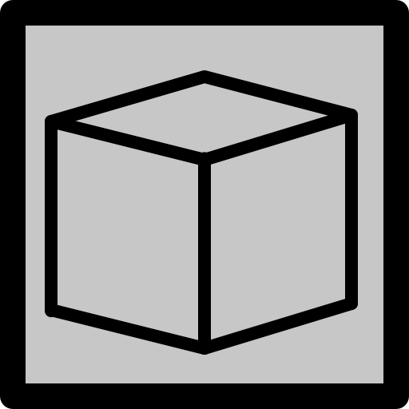

# @rhinodavid KiCad Parts Library

<!-- This an autogenerated file! DO NOT EDIT. Update README.hbs and run generate script. <-->

> High quality eCAD parts made by me. Shared with you.

KiCad assets for parts I'm
using in my designs. These are parts that I couldn't find eCAD resources for on
the internet, so I made them by hand.

Most of these parts are available on
Digikey. Look for a link to Digikey in the symbol metadata.

## Compatibility

KiCad 6.0 and above

## Parts

### OLED_SSD1306

        
        
        

192x64 OLED display available on eBay and [buydisplay.com](https://www.buydisplay.com/datasheet-128x64-oled-module-spi-0-96-inch-graphic-displays-white-on-black).

    
    
    

### MMSZ5261BT1G

        
        
        

Zener Diode 47 V 500 mW ±5% Surface Mount SOD-123.

### Neopixel 3535

        
        
        

WS2812B Neopixel LED in a 3.5mm x 3.5mm package.

### 1206L150TH

        
        
        

Polymeric PTC Resettable Fuse 8V 1.5 A in a SMD 1206 package.

### SSM3J331

        
        
        

P-Channel SMD MOSFET, 20 V 4A 1W SOT-23F.

