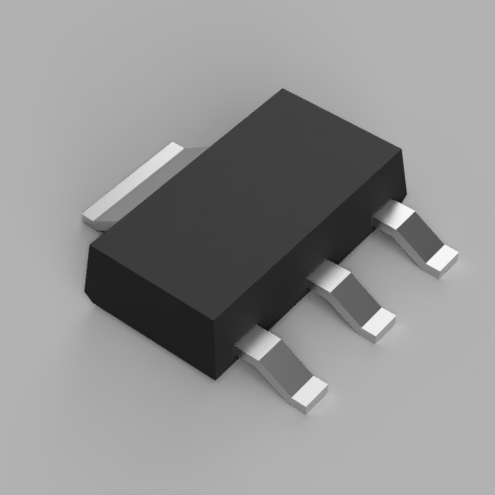

# @rhinodavid KiCad Parts Library

<!-- This an autogenerated file! DO NOT EDIT. Update README.hbs and run generate script. <-->

> High quality eCAD parts made by me. Shared with you.

KiCad assets for parts I'm
using in my designs. These are parts that I couldn't find eCAD resources for on
the internet, so I made them by hand.

Most of these parts are available on
Digikey. Look for a link to Digikey in the symbol metadata.

## Compatibility

KiCad 6.0 and above

## Adding a part

- Add symbol to library using eSchema
- Add footprint to `rhinodavid.pretty` directory
- Add STEP file to `rhinodavid.pretty` directory
  - Make sure the 3D model is assigned to and properly positioned on the footprint
- Add images to `./docs/readme/img`
- Update `./docs/readme/data.json` with the new part
- Regenerate the README
  - This requires the [Handlebars CLI](https://www.npmjs.com/package/hbs-cli)
  - Run `./docs/readme/generate.sh`

## Parts

### Legend

        
        Symbol included

        
        Footprint included

        
        3D model included

### OLED_SSD1306_folded

        
        
        

192x64 OLED display available on eBay and [buydisplay.com](https://www.buydisplay.com/datasheet-128x64-oled-module-spi-0-96-inch-graphic-displays-white-on-black). The display is mounted face down and then folded backwards.

    
    
    

### MMSZ5261BT1G

        
        
        

Zener Diode 47 V 500 mW ±5% Surface Mount SOD-123.

    

### Adafruit Neopixel Mini 4957

        
        
        

SK6812MINI Neopixel LED in a 3.5mm x 3.5mm package.

    

### 1206L150TH

        
        
        

Littelfuse, Inc. Polymeric PTC Resettable Fuse 8V 1.5 A in a SMD 1206 package.

    

### SSM3J331R

        
        
        

P-Channel SMD MOSFET, 20 V 4A 1W SOT-23F.

    

### 74AUP1T00GX

        
        
        

1 Channel Schmitt Trigger NAND Gate IC in a 5-X2SON (0.80mm x 0.80mm) package. Great for button debouncing.

    
    
    

### TLSM-D-T3-C-020-G

        
        
        

6mm SPDT SMD tactile switch. Use with 74AUP1T00GX for a debounce.

    

### TBL003-254-04GR-2OR

        
        
        

4 Position Wire to Board Terminal Block Horizontal 0.1" (2.54mm) Through Hole.

    
    

### BU33UV7NUX

        
        
        

Synchronous Boost DC/DC Converter 3.3 V

### TPS61098x

        
        
        

Ultra-Low Quiescent Current Synchronous Boost with Integrated LDO/Load Switch

    

### 831068248

        
        
        

Wurth Electronic IQXO-540 Standard 2 x 1.6 crystal oscillator in a ceramic package with a seam sealed metal lid, hermetically sealed.

    
    
    

### AMCA31-2R450G-S1F-T3

        
        
        

Surface Mount WLAN / Bluetooth Chip Antenna (2450MHz)

    

### SMBJ8.0D-M3/H

        
        
        

Vishay General Semiconductor TVS Diode 13.4VC; DO214AA package

    

### JTX310

        
        
        

Jauch Quartz 32.768 kHz ±20ppm Crystal 7pF 70 kOhms 2-SMD, No Lead

    

### DMN2005K-7

        
        
        

Diodes Inc. N-Channel 20V 300mA (Ta) 350mW (Ta) Surface Mount SOT-23-3 MOSFET

    

### LDL1117S33R

        
        
        

STMicroelectronics Linear Voltage Regulator IC Positive Fixed 1 Output 1.2A SOT-223

    

### PKMCS0909E4000-R1

        
        
        

Murata Electronics Buzzer Transducer, Externally Driven Piezo 1.5 V - 4kHz 65dB @ 1.5V, 10cm Surface Mount

    

### EC-10

        
        
        

Tag Connect EdgeConnect 10-pin Castellated Board-Edge Connector

    

### Arm 10 Pin

        
        
        

An ARM 10 pin connector with pin definitions for JTAG and SWD

    

### STLink V2 Clone Adapter

        
        
        

Check your clone to make sure the pinout is the same -- some vary

    
    

### ECX-1637

        
        
        

4-SMD no lead crystal oscillator

    

